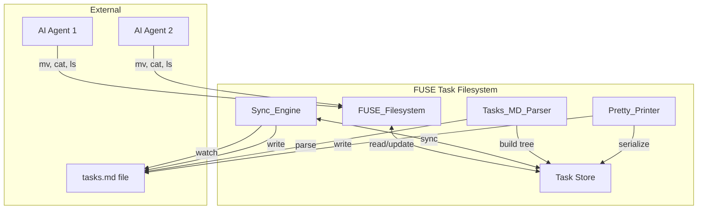
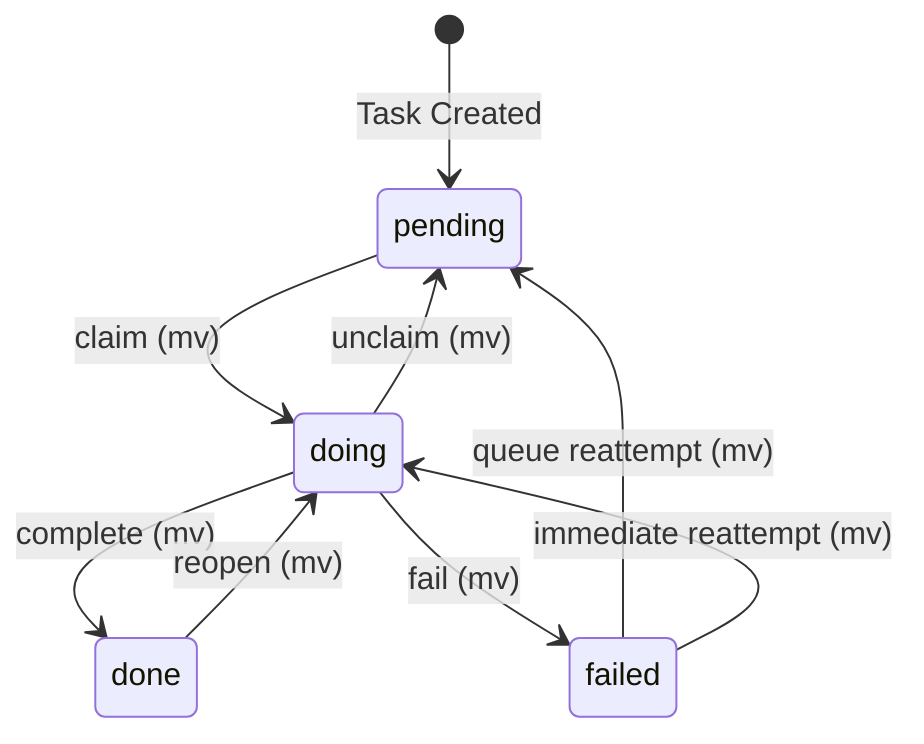
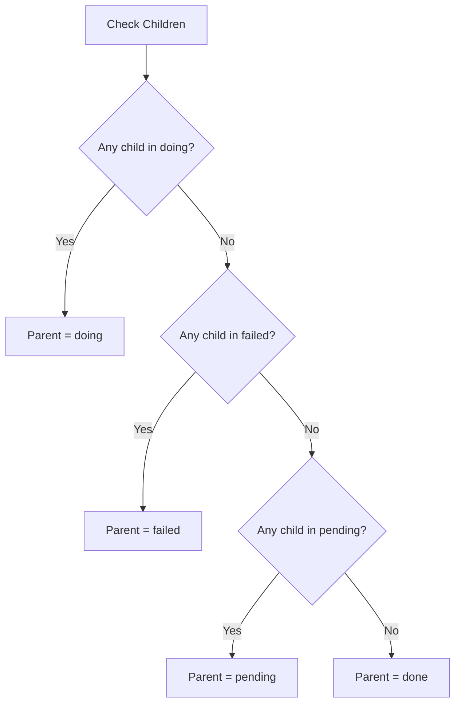

# Design Document: FUSE Task Filesystem

## Overview

The FUSE Task Filesystem is a virtual filesystem that exposes Kiro PRD tasks.md files as a navigable directory structure. It enables multiple AI agents to work on tasks concurrently by leveraging filesystem semantics for atomic operations, eliminating race conditions through the natural behavior of file move operations.

The system consists of four main components:
1. **Tasks_MD_Parser**: Parses tasks.md markdown into a hierarchical task tree
2. **Pretty_Printer**: Serializes task objects back to markdown format
3. **FUSE_Filesystem**: Implements FUSE operations to expose tasks as files/directories
4. **Sync_Engine**: Maintains bidirectional synchronization between filesystem and tasks.md

## Architecture



### Component Interaction Flow

1. **Startup**: Parser reads tasks.md → builds task tree → populates Task Store
2. **Read Operations**: FUSE receives read → queries Task Store → returns content
3. **Move Operations**: FUSE receives rename → acquires lock → updates Task Store → triggers sync
4. **External Changes**: Sync_Engine detects file change → Parser re-parses → updates Task Store
5. **Shutdown**: Sync_Engine flushes pending changes → Pretty_Printer writes tasks.md

## Components and Interfaces

### Implementation Language: Go

Go is chosen for this implementation due to:
- Excellent concurrency primitives (goroutines, channels, `sync.RWMutex`)
- Mature FUSE library (`bazil.org/fuse`)
- Strong standard library for file I/O and path manipulation
- Simple deployment (single binary)

### Task Data Model

```go
type TaskStatus string

const (
    StatusPending TaskStatus = "pending"
    StatusDoing   TaskStatus = "doing"
    StatusDone    TaskStatus = "done"
    StatusFailed  TaskStatus = "failed"
)

// FileLine represents any line in the file
type FileLine struct {
    LineNumber  int
    RawContent  string
    IndentLevel int  // Computed indent level (tabs converted to 2 spaces, then counted)
}

// NonTaskContent represents non-task lines (headings, preamble, comments)
type NonTaskContent struct {
    FileLine
}

// Task represents a parsed task line
// Task ID Format: Dot-separated positive integers matching regex ^[1-9][0-9]*(\.[1-9][0-9]*)*$
// Examples: "1", "1.2", "1.2.3", "10.5.2"
// Invalid: "01.1" (leading zero), "1.2.a" (non-numeric), "1..2" (empty segment)
// Maximum depth: 10 levels
type Task struct {
    FileLine
    ID          string       // Numeric ID like "1.1" - REQUIRED, must match Task ID Format
    Title       string       // Task title text
    Status      TaskStatus   // Current status
    Description []FileLine   // Lines attached to this task
    Children    []*Task      // Sub-tasks (empty for leaf tasks)
    Parent      *Task        // Parent task reference (nil for root tasks)
}

// ParsedDocument represents the complete parsed file
type ParsedDocument struct {
    Preamble  []NonTaskContent // Lines before first task
    RootTasks []*Task          // Top-level tasks with nested children
    Epilogue  []NonTaskContent // Lines after last task
}

// PathEntry for efficient path lookup
type PathEntry struct {
    Task     *Task
    Status   TaskStatus // Current status (may differ during transitions)
    FullPath string     // Full path from mount root
}

// TaskStore holds all task data with concurrent access support
type TaskStore struct {
    Document    *ParsedDocument
    TasksByPath map[string]*PathEntry // Full path → PathEntry
    TasksByID   map[string]*PathEntry // Task ID → PathEntry
    PathByTask  map[*Task]string      // Task → current path
    RWLock      sync.RWMutex          // Read-write lock for concurrent access
}
```

**Path Management:**

When a task's status changes (or a parent's derived status changes), all affected paths must be updated:

```go
type PathManager struct {
    store *TaskStore
}

// RebuildPaths rebuilds paths for a task and all its descendants
func (pm *PathManager) RebuildPaths(task *Task, newStatus TaskStatus, parentPath string) {
    filename := pm.GenerateFilename(task)
    newPath := parentPath + "/" + filename

    // Update all indexes
    oldPath := pm.store.PathByTask[task]
    delete(pm.store.TasksByPath, oldPath)

    entry := &PathEntry{Task: task, Status: newStatus, FullPath: newPath}
    pm.store.TasksByPath[newPath] = entry
    pm.store.TasksByID[task.ID] = entry
    pm.store.PathByTask[task] = newPath

    // Recursively update children (they move with parent)
    for _, child := range task.Children {
        childStatus := pm.DeriveStatus(child)
        pm.RebuildPaths(child, childStatus, newPath)
    }
}

// OnStatusChange is called when any task status changes
func (pm *PathManager) OnStatusChange(task *Task) {
    // Find root ancestor and rebuild entire subtree
    root := task
    for root.Parent != nil {
        root = root.Parent
    }

    rootStatus := pm.DeriveStatus(root)
    pm.RebuildPaths(root, rootStatus, "/"+string(rootStatus))
}
```

### Tasks_MD_Parser Interface

```go
type ParseError struct {
    LineNumber int
    Message    string
    RawLine    string
}

type ParseResult struct {
    Document *ParsedDocument
    Errors   []ParseError
}

type Parser struct {
    // TaskIDRegex validates task ID format: positive integers separated by dots
    // Pattern: ^[1-9][0-9]*(\.[1-9][0-9]*)*$
    // Max depth: 10 levels
    TaskIDRegex *regexp.Regexp
}

func NewParser() *Parser

func (p *Parser) Parse(content string) *ParseResult
func (p *Parser) ParseCheckbox(line string) (TaskStatus, bool)
func (p *Parser) ExtractTaskID(line string) (string, bool)  // Returns false for invalid formats
func (p *Parser) ValidateTaskID(id string) bool              // Validates against Task ID Format
func (p *Parser) ComputeIndentLevel(line string) int         // Handles tabs (1 tab = 2 spaces)
func (p *Parser) BuildHierarchy(flatTasks []*Task) []*Task
func (p *Parser) FindAncestorByIDPrefix(id string, tasks []*Task) *Task  // For orphaned ID resolution
```

### Pretty_Printer Interface

```go
type Printer struct{}

func (p *Printer) Serialize(doc *ParsedDocument) string
func (p *Printer) FormatTask(task *Task) string
func (p *Printer) StatusToCheckbox(status TaskStatus) string
```

### FUSE_Filesystem Interface

```go
import (
    "bazil.org/fuse"
    "bazil.org/fuse/fs"
)

// FuseFS implements the FUSE filesystem
type FuseFS struct {
    store      *TaskStore
    syncEngine *SyncEngine
    mountPoint string
}

// Implement fs.FS interface
func (f *FuseFS) Root() (fs.Node, error)

// Directory node (status dir or task dir)
type Dir struct {
    fs   *FuseFS
    path string
}

func (d *Dir) Attr(ctx context.Context, a *fuse.Attr) error
func (d *Dir) Lookup(ctx context.Context, name string) (fs.Node, error)
func (d *Dir) ReadDirAll(ctx context.Context) ([]fuse.Dirent, error)

// File node (task file or index.md)
type File struct {
    fs   *FuseFS
    path string
    task *Task // nil for index.md files
}

func (f *File) Attr(ctx context.Context, a *fuse.Attr) error
func (f *File) Read(ctx context.Context, req *fuse.ReadRequest, resp *fuse.ReadResponse) error

// Rename handler (status transitions ONLY)
// Returns:
// - nil: success
// - fuse.EPERM: same-dir rename, filename change, parent dir, invalid transition
// - fuse.ENOENT: source doesn't exist or concurrent move
func (d *Dir) Rename(ctx context.Context, req *fuse.RenameRequest, newDir fs.Node) error

// All mutating operations return EPERM or EROFS
func (f *File) Write(ctx context.Context, req *fuse.WriteRequest, resp *fuse.WriteResponse) error // EPERM
func (d *Dir) Create(ctx context.Context, req *fuse.CreateRequest, resp *fuse.CreateResponse) (fs.Node, fs.Handle, error) // EPERM
func (d *Dir) Remove(ctx context.Context, req *fuse.RemoveRequest) error // EPERM
func (d *Dir) Mkdir(ctx context.Context, req *fuse.MkdirRequest) (fs.Node, error) // EPERM
func (f *File) Setattr(ctx context.Context, req *fuse.SetattrRequest, resp *fuse.SetattrResponse) error // EROFS
```

### Sync_Engine Interface

```go
import (
    "github.com/fsnotify/fsnotify"
    "time"
)

type FileChange struct {
    Timestamp time.Time
    Content   string
}

type SyncEngine struct {
    store       *TaskStore
    parser      *Parser
    printer     *Printer
    tasksFile   string
    watcher     *fsnotify.Watcher
    changeQueue chan FileChange
    stopChan    chan struct{}
}

func NewSyncEngine(store *TaskStore, parser *Parser, printer *Printer, tasksFile string) *SyncEngine

// File watching
func (s *SyncEngine) StartWatching() error
func (s *SyncEngine) StopWatching()

// Synchronization
func (s *SyncEngine) SyncFromFile() error
func (s *SyncEngine) SyncToFile() error

// Conflict resolution
func (s *SyncEngine) QueueExternalChange(change FileChange)
func (s *SyncEngine) ProcessQueuedChanges()

// Parent status derivation
func (s *SyncEngine) DeriveParentStatus(parent *Task) TaskStatus
func (s *SyncEngine) UpdateParentStatuses()
```

## Data Models

### Filesystem Structure

```
/mount_point/
├── index.md                              # Root index with status counts
├── pending/
│   ├── index.md                          # List of pending tasks
│   ├── 1.setup_project/                  # Parent task (directory)
│   │   ├── index.md                      # Parent description + sub-task list
│   │   ├── 1.1.create_structure.md       # Leaf task (file)
│   │   └── 1.2.configure_build.md        # Leaf task (file)
│   └── 2.implement_feature.md            # Leaf task (file)
├── doing/
│   ├── index.md
│   └── 3.write_tests.md
├── done/
│   ├── index.md
│   └── 4.initial_setup.md
└── failed/
    ├── index.md
    └── 5.broken_feature.md
```

### Checkbox Syntax Mapping

| Status  | Checkbox | Example |
|---------|----------|---------|
| Pending | `- [ ]`  | `- [ ] 1.1 Create structure` |
| Doing   | `- [-]`  | `- [-] 1.2 Configure build` |
| Done    | `- [x]`  | `- [x] 1.3 Setup complete` |
| Failed  | `- [!]`  | `- [!] 1.4 Broken feature` |

### State Transition Diagram



### Parent Status Derivation

Parent task status is automatically derived from children with this precedence:



## Concrete Examples

### Example 1: Basic Parsing and Filesystem Structure

**Input tasks.md:**
```markdown
# Project Tasks

- [ ] 1. Setup project
  Initialize the project structure
  - [x] 1.1 Create directory structure
  - [-] 1.2 Configure build system
  - [ ] 1.3 Add dependencies
- [x] 2. Write documentation
  Document the API
```

**Parsed Task Tree:**
```
ParsedDocument:
  Preamble: ["# Project Tasks", ""]
  RootTasks:
    - Task(id="1", title="Setup project", status=derived)
      Description: ["  Initialize the project structure"]
      Children:
        - Task(id="1.1", title="Create directory structure", status=done)
        - Task(id="1.2", title="Configure build system", status=doing)
        - Task(id="1.3", title="Add dependencies", status=pending)
    - Task(id="2", title="Write documentation", status=done)
      Description: ["  Document the API"]
  Epilogue: []
```

**Derived Parent Status for Task 1:**
- Child 1.2 is `doing` → Parent 1 derives status `doing`

**Resulting Filesystem Structure:**
```
/mount/
├── index.md
├── pending/
│   └── index.md                          # Empty (no pending root tasks)
├── doing/
│   ├── index.md
│   └── 1.setup_project/                  # Parent at derived status location
│       ├── index.md
│       ├── 1.1.create_directory_structure.md   # Child stays with parent
│       ├── 1.2.configure_build_system.md       # Child stays with parent
│       └── 1.3.add_dependencies.md             # Child stays with parent
├── done/
│   ├── index.md
│   └── 2.write_documentation.md          # Leaf task at its own status
└── failed/
    └── index.md
```

**Critical Rule: Children Live Under Parent Directory**

Children are always located under their parent's directory, regardless of the child's individual status. The parent directory is placed in the status directory matching the parent's *derived* status.

In this example:
- Task 1.1 (done), 1.2 (doing), 1.3 (pending) all appear under `/doing/1.setup_project/`
- They do NOT appear in `/done/`, `/doing/`, `/pending/` respectively
- The parent's derived status (doing) determines the entire subtree's location

### Example 2: Task File Content

**Reading `/doing/1.setup_project/1.2.configure_build_system.md`:**
```markdown
# 1.2. Configure build system

**Status:** doing

```

**Reading `/doing/1.setup_project/index.md`:**
```markdown
# 1. Setup project

**Status:** doing

Initialize the project structure

## Sub-tasks

- ✅ 1.1. Create directory structure
- 🔄 1.2. Configure build system
- ⬜ 1.3. Add dependencies
```

### Example 3: Atomic Move Race Condition

**Scenario:** Two agents (A and B) simultaneously try to claim task `1.3.add_dependencies.md`

**Timeline:**
```
T0: Agent A: mv /doing/1.setup_project/1.3.add_dependencies.md → (starts)
T0: Agent B: mv /doing/1.setup_project/1.3.add_dependencies.md → (starts)
T1: Agent A: Acquires write lock
T1: Agent B: Blocks waiting for lock
T2: Agent A: Updates task 1.3 status to "doing", releases lock
T3: Agent B: Acquires lock, finds task 1.3 already moved
T3: Agent B: Returns ENOENT (file no longer at source path)
```

**Result:**
- Agent A: Success (task claimed)
- Agent B: ENOENT error (should re-scan and pick different task)

### Example 4: Sync Conflict Resolution

**Scenario:** Filesystem move and external edit happen simultaneously

**Timeline:**
```
T0: Filesystem state: Task 1.3 is pending
T0: External editor opens tasks.md
T1: Agent moves 1.3 from pending → doing (filesystem operation)
T2: External editor saves tasks.md with 1.3 still as pending
T3: Sync_Engine detects external change
T4: Sync_Engine compares: filesystem says "doing", file says "pending"
T5: Sync_Engine: Filesystem wins → writes "doing" back to tasks.md
```

**Result:** Task 1.3 remains "doing" (filesystem operation takes precedence)

### Example 5: Filename Slugification

| Task Title | Slugified Result | Full Filename |
|------------|------------------|---------------|
| `Implement the Parser` | `implement_the_parser` | `1.1.implement_the_parser.md` |
| `Add UTF-8 Support!!!` | `add_utf-8_support` | `1.2.add_utf-8_support.md` |
| `   Trim   Spaces   ` | `trim_spaces` | `1.3.trim_spaces.md` |
| `UPPERCASE lowercase` | `uppercase_lowercase` | `1.4.uppercase_lowercase.md` |
| `Special @#$% chars` | `special_chars` | `1.5.special_chars.md` |
| `` (empty) | `task` | `1.6.task.md` |
| `A very long title that exceeds the maximum allowed length for filenames` | `a_very_long_title_that_exceeds_the_maximum_allowe` | `1.7.a_very_long_title_that_exceeds_the_maximum_allowe.md` |

### Example 6: Orphaned Children Handling

**Scenario:** External edit removes parent task but leaves children

**Before (tasks.md):**
```markdown
- [ ] 1. Setup project
  - [x] 1.1 Create structure
  - [ ] 1.2 Configure build
- [ ] 2. Documentation
```

**After external edit (tasks.md):**
```markdown
- [x] 1.1 Create structure
- [ ] 1.2 Configure build
- [ ] 2. Documentation
```

**Sync_Engine behavior:**
1. Detects task `1` was removed but `1.1` and `1.2` still exist
2. Logs warning: "Orphaned tasks detected: 1.1, 1.2 (parent 1 removed)"
3. Promotes `1.1` and `1.2` to root level (since `1` was a root task)
4. Preserves original IDs (`1.1`, `1.2` - not renumbered)

**Resulting filesystem:**
```
/mount/
├── pending/
│   ├── 1.2.configure_build.md    # Promoted to root, keeps ID
│   └── 2.documentation.md
├── done/
│   └── 1.1.create_structure.md   # Promoted to root, keeps ID
...
```

### Example 7: Invalid Task ID Handling

**Input tasks.md with invalid IDs:**
```markdown
- [ ] 1. Valid task
  - [ ] 01.1 Invalid (leading zero)
  - [ ] 1.2 Valid subtask
  - [ ] 1.2.a Invalid (non-numeric)
- [ ] 2. Another valid task
```

**Parser behavior:**
- `1.` → Valid task, parsed
- `01.1` → Invalid ID format, treated as description of task 1
- `1.2` → Valid task, parsed as child of 1
- `1.2.a` → Invalid ID format, treated as description of task 1.2
- `2.` → Valid task, parsed

**Resulting task tree:**
```
Task(id="1", title="Valid task")
  Description: ["  - [ ] 01.1 Invalid (leading zero)"]
  Children:
    - Task(id="1.2", title="Valid subtask")
      Description: ["  - [ ] 1.2.a Invalid (non-numeric)"]
Task(id="2", title="Another valid task")
```

## Detailed Component Design

### Tasks_MD_Parser

The parser processes tasks.md files line by line, building a hierarchical task tree while preserving all non-task content.

**Content Attachment Rules:**
1. **Preamble**: All lines before the first valid task line are stored as preamble (headings, intro text)
2. **Valid Task**: A line with checkbox syntax AND a numeric ID (e.g., `- [ ] 1.1 Task title`)
3. **No-ID Checkbox Lines**: Lines with checkbox syntax but NO numeric ID are NOT parsed as tasks; they are treated as regular non-task content and preserved (attached to the preceding task's description or stored as preamble/epilogue depending on position)
4. **Task Ownership**: A task "owns" all subsequent lines until a new valid task at an equal or lesser indent level is encountered. This block of lines is the task's content.
5. **Description Attachment**: Within a task's content block, any line that is not a valid sub-task (including no-ID checkbox lines) is attached to the task as part of its description. This includes indented text, blank lines, no-ID checkbox lines, and even content at a lesser indent level.
6. **Sub-tasks**: Within a task's content block, any line that is a valid task (has checkbox AND numeric ID) and is more indented than the parent becomes a child task.
7. **Epilogue**: All lines after the last task and its content block are stored as epilogue.

**Indentation-Based Attachment Example:**
```markdown
# Heading                    → preamble
Some intro text              → preamble

- [ ] 1. First task          → task (id="1")
  Description line           → attached to task 1
  - More description         → attached to task 1
  - [ ] 1.1 Sub-task         → child of task 1 (id="1.1")
    Sub-task detail          → attached to task 1.1

- [ ] 2. Second task         → task (id="2")
  - [ ] No ID here           → attached to task 2 as description (per rule 3 & 5)
```

**Parsing Algorithm:**
1. Read file line by line, tracking line numbers
2. Collect preamble lines until first valid task is found
3. For each line after preamble:
   - Compute indent level: convert tabs to 2 spaces, then count total spaces / 2 (floor)
   - If line matches checkbox pattern `^\s*- \[([ x\-!])\]\s*(.*)$`:
     - Extract numeric ID using pattern `^([1-9][0-9]*(?:\.[1-9][0-9]*)*)\.?\s+(.*)$`
     - Validate ID: no leading zeros, max 10 levels deep
     - If valid numeric ID found: Create Task with extracted status, ID, and title; attach to parent based on indent level
     - If NO valid numeric ID found (including invalid formats like `01.1`): Treat as non-task content (attach to current task's description or store as epilogue)
   - If line does not match checkbox pattern and is more indented than current task:
     - Attach as description to current task
   - If line does not match checkbox pattern and is at root level:
     - Store as epilogue (or between-task content attached to previous task)
4. Build parent-child relationships based on indent levels
5. Handle orphaned IDs: If task ID implies missing parent (e.g., `1.2.3` but no `1.2`), attach to nearest valid ancestor by ID prefix match, or treat as root task
6. Return ParsedDocument with preamble, rootTasks, and epilogue

**Indentation Handling:**
- 2-4 spaces = 1 indent level (flexible)
- 1 tab = 1 indent level (converted to 2 spaces internally)
- Mixed tabs/spaces: tabs converted first, then spaces counted
- Hierarchy determined by relative indent comparison, not absolute values

**Checkbox Pattern Matching:**
```
- [ ] 1.1 Task title    →  VALID TASK: status=pending, id="1.1", title="Task title"
- [-] 2.1 Another task  →  VALID TASK: status=doing, id="2.1", title="Another task"
- [x] 10.5.2 Deep task  →  VALID TASK: status=done, id="10.5.2", title="Deep task"
- [!] 1.2 Failed task   →  VALID TASK: status=failed, id="1.2", title="Failed task"
- [x] Done task         →  NO-ID: preserved as non-task content (not a task)
- [!] Failed task       →  NO-ID: preserved as non-task content (not a task)
- [ ] No number here    →  NO-ID: preserved as non-task content (not a task)
- [ ] 01.1 Leading zero →  INVALID-ID: preserved as non-task content (leading zero)
- [ ] 1.2.a Non-numeric →  INVALID-ID: preserved as non-task content (non-numeric segment)
- [ ] 1..2 Empty seg    →  INVALID-ID: preserved as non-task content (empty segment)
```

**Hierarchy Building:**
- Track a stack of (indent_level, task) pairs
- When encountering a new valid task (has checkbox AND valid numeric ID):
  - Pop stack until finding a task with lower indent level
  - That task becomes the parent
  - Push new task onto stack

**Indent Level Computation:**
```go
func (p *Parser) ComputeIndentLevel(line string) int {
    spaces := 0
    for _, ch := range line {
        if ch == '\t' {
            spaces += 2  // 1 tab = 2 spaces
        } else if ch == ' ' {
            spaces++
        } else {
            break
        }
    }
    // 2-4 spaces = 1 level (use floor division by 2)
    return spaces / 2
}
```

**Orphaned ID Resolution:**
When a task ID implies a missing parent (e.g., `1.2.3` exists but `1.2` does not):
1. Extract ID prefix segments: `1.2.3` → `["1", "1.2", "1.2.3"]`
2. Search for nearest existing ancestor by prefix match
3. If found, attach as child of that ancestor
4. If no ancestor found, treat as root task
5. Log warning about orphaned ID

### Pretty_Printer

The printer serializes the ParsedDocument back to markdown format, preserving all content.

**Serialization Rules:**
1. Output preamble lines first (unchanged)
2. For each root task (in original line order):
   - Output task line with correct checkbox and indentation
   - Output description lines (unchanged)
   - Recursively output children
3. Output epilogue lines last (unchanged)

**Preservation Guarantees:**
- Line order is preserved (tasks maintain original relative order)
- Non-task content is output exactly as parsed (rawContent)
- Only checkbox characters are modified when status changes
- Indentation is preserved from original

**Output Format:**
```markdown
- [ ] 1. Parent task
  - Description line 1
  - Description line 2
  - [ ] 1.1 Child task
  - [x] 1.2 Completed child
```

### FUSE_Filesystem

The FUSE implementation maps filesystem operations to task store operations.

**Path Resolution:**
```
/                           → Root (list status dirs)
/index.md                   → Root index file
/pending                    → Status directory
/pending/index.md           → Status index file
/pending/1.task.md          → Leaf task file
/pending/2.parent/          → Parent task directory
/pending/2.parent/index.md  → Parent task index
/pending/2.parent/2.1.child.md → Nested leaf task
```

**Filename Generation:**
1. All valid tasks have IDs, so filename is always: `{id}.{slugified_title}.md`
2. If collision: append `-{n}` before `.md`
3. Lines with checkbox syntax but no numeric ID are ignored and not exposed as files

**Index File Generation (On-Demand):**
Index files are virtual and generated at read time to ensure they always reflect current state:

```go
type IndexGenerator struct {
    store *TaskStore
}

// GenerateRootIndex generates the root index.md content
func (ig *IndexGenerator) GenerateRootIndex() string {
    counts := ig.getStatusCounts()
    return fmt.Sprintf("# Task Overview\n\n"+
        "- pending/: %d tasks\n"+
        "- doing/: %d tasks\n"+
        "- done/: %d tasks\n"+
        "- failed/: %d tasks\n",
        counts[StatusPending], counts[StatusDoing], counts[StatusDone], counts[StatusFailed])
}

// GenerateStatusIndex generates a status directory index.md content
// Format: Markdown list of all tasks within the status directory (Requirement 3.7)
func (ig *IndexGenerator) GenerateStatusIndex(status TaskStatus) string {
    tasks := ig.getTasksByStatus(status)
    title := strings.Title(string(status))
    content := fmt.Sprintf("# %s Tasks\n\n", title)
    for _, task := range tasks {
        icon := "📄"
        if len(task.Children) > 0 {
            icon = "📁"
        }
        content += fmt.Sprintf("- %s %s. %s\n", icon, task.ID, task.Title)
    }
    return content
}

// GenerateTaskIndex generates a parent task directory index.md content
// Format: Parent task description followed by sub-task list (Requirement 3.8)
// Content follows Task File Content Format specification in requirements.md
func (ig *IndexGenerator) GenerateTaskIndex(task *Task) string {
    derivedStatus := ig.deriveStatus(task)
    content := fmt.Sprintf("# %s. %s\n\n**Status:** %s\n\n", task.ID, task.Title, derivedStatus)
    // Include parent's description (preserved exactly as in tasks.md)
    for _, line := range task.Description {
        content += line.RawContent + "\n"
    }
    content += "\n## Sub-tasks\n\n"
    for _, child := range task.Children {
        emoji := ig.getStatusEmoji(child.Status)
        content += fmt.Sprintf("- %s %s. %s\n", emoji, child.ID, child.Title)
    }
    return content
}

// GenerateTaskFileContent generates content for a leaf task file
// Format follows Task File Content Format specification in requirements.md:
// # {task_id}. {title}
// **Status:** {status}
// {description lines, preserved exactly as in tasks.md}
func (ig *IndexGenerator) GenerateTaskFileContent(task *Task) string {
    content := fmt.Sprintf("# %s. %s\n\n**Status:** %s\n\n", task.ID, task.Title, task.Status)
    for _, line := range task.Description {
        content += line.RawContent + "\n"
    }
    return content
}

func (ig *IndexGenerator) getStatusEmoji(status TaskStatus) string {
    switch status {
    case StatusPending: return "⬜"
    case StatusDoing:   return "🔄"
    case StatusDone:    return "✅"
    case StatusFailed:  return "❌"
    default:            return "❓"
    }
}
```

**Slugification Rules:**

See "Filename Slugification Rules" in requirements.md for the complete algorithm. Summary:
1. Convert to lowercase ASCII (non-ASCII transliterated or removed)
2. Replace whitespace sequences with single underscore
3. Keep only `[a-z0-9_-]`
4. Collapse multiple underscores
5. Trim leading/trailing underscores
6. Truncate to 50 chars (at word boundary if possible)
7. Use `task` if empty
8. Format: `{id}.{slug}.md` (e.g., `1.2.implement_parser.md`)

**Collision Handling (Requirement 7.6):**
If filename collision occurs, append numeric suffix before extension:
- First occurrence: `1.1.implement_parser.md`
- Second occurrence: `1.1.implement_parser-2.md`
- Third occurrence: `1.1.implement_parser-3.md`

**Atomic Move Implementation:**
```
1. Acquire write lock (blocks readers and other writers)
2. Validate source path exists → ENOENT if not
3. Extract source and destination status directories
4. Validate this is a cross-directory move → EPERM if same directory
5. Validate filename is unchanged → EPERM if filename differs
6. Validate source is a leaf task file → EPERM if parent directory
7. Validate transition is allowed per Requirement 6.1 → EPERM if invalid
8. Update task status in store
9. Trigger parent status recalculation and path rebuilding
10. Queue sync to file
11. Release write lock
```

**Locking Strategy:**
- Read operations (readdir, read, getattr): Acquire read lock
- Write operations (rename): Acquire write lock
- Multiple concurrent reads are allowed
- Writes have exclusive access (no concurrent reads or writes)
- This allows high read throughput while ensuring atomic status transitions

**Rename Validation Rules:**
- Same-directory renames: EPERM (no renaming files within a status dir)
- Filename changes: EPERM (cannot change task title/ID via filesystem)
- Parent directory moves: EPERM (parent status is derived)
- Invalid transitions: EPERM (e.g., pending→done)

### Sync_Engine

The sync engine maintains consistency between filesystem and tasks.md.

**File Watching:**
- Use inotify (Linux) or FSEvents (macOS) to detect changes
- Debounce rapid changes (e.g., 100ms window)
- Queue changes during filesystem operations

**Sync-to-File Process:**
1. Acquire lock
2. Serialize task tree via Pretty_Printer
3. Write to temporary file
4. Atomic rename to tasks.md
5. Release lock

**Sync-from-File Process:**
1. Wait for any in-progress filesystem operations
2. Acquire lock
3. Parse new file content
4. Diff against current task store
5. Apply non-conflicting changes
6. Discard conflicting changes (filesystem wins)
7. Release lock

**Parent Status Derivation:**
After any status change, traverse up the tree and recalculate each parent's status using the precedence rules from Requirement 4.7.

## CLI Interface

### Commands

```
task-fuse <command> [options] [arguments]

Commands:
  mount     Mount a tasks.md file as a FUSE filesystem
  unmount   Unmount a previously mounted filesystem
  status    Show status of mounted filesystems
  version   Show version information
```

### Mount Command

```
task-fuse mount [options] <tasks.md> <mountpoint>

Arguments:
  tasks.md      Path to the tasks.md file to mount
  mountpoint    Directory to mount the filesystem on (must exist and be empty)

Options:
  --foreground, -f    Run in foreground (default: daemonize)
  --log-level LEVEL   Set log level: error, warn, info, debug (default: info)
  --log-format FMT    Set log format: text, json (default: text)
  --log-file PATH     Write logs to file instead of stderr
  --sync-interval MS  Polling interval in ms if file watching fails (default: 1000)
```

### Unmount Command

```
task-fuse unmount [options] <mountpoint>

Arguments:
  mountpoint    The mounted filesystem to unmount

Options:
  --force, -f   Force unmount even if busy (may lose pending changes)
  --timeout N   Wait N seconds for pending operations (default: 5)
```

### Status Command

```
task-fuse status [mountpoint]

Arguments:
  mountpoint    (Optional) Check specific mountpoint, or list all if omitted

Output (text format):
  Mountpoint: /mnt/tasks
    Source: /home/user/project/tasks.md
    PID: 12345
    Uptime: 2h 15m
    Tasks: 42 (12 pending, 3 doing, 25 done, 2 failed)
    Last Sync: 2024-01-15 10:30:45 (to-file)
```

### Exit Codes

| Code | Meaning |
|------|---------|
| 0 | Success |
| 1 | General error (invalid arguments, file not found) |
| 2 | Mount failed (FUSE error, mountpoint busy) |
| 3 | Parse error (invalid tasks.md format) |

## Correctness Properties

*A property is a characteristic or behavior that should hold true across all valid executions of a system—essentially, a formal statement about what the system should do. Properties serve as the bridge between human-readable specifications and machine-verifiable correctness guarantees.*

### Property 1: Parser Round-Trip Consistency

*For any* valid task tree, serializing it with Pretty_Printer and then parsing the result with Tasks_MD_Parser SHALL produce an equivalent task tree.

**Validates: Requirements 1.8, 1.9, 1.10**

### Property 2: Checkbox Status Mapping

*For any* task line with a valid checkbox syntax (`- [ ]`, `- [-]`, `- [x]`, `- [!]`), the Tasks_MD_Parser SHALL map it to the corresponding status (pending, doing, done, failed respectively).

**Validates: Requirements 1.1, 1.2, 1.3, 1.4**

### Property 3: Task Hierarchy Preservation

*For any* tasks.md file with nested tasks (based on indentation), parsing SHALL produce a task tree where parent-child relationships match the indentation hierarchy, and the filesystem SHALL expose this hierarchy as nested directories.

**Validates: Requirements 1.7, 2.3, 2.4**

### Property 4: Status Directory Placement

*For any* task with a given status, the FUSE_Filesystem SHALL expose it within the corresponding status directory (`pending/`, `doing/`, `done/`, or `failed/`).

**Validates: Requirements 2.5, 2.6, 2.7, 2.8**

### Property 5: Filename Generation Consistency

*For any* task, the generated filename SHALL follow the pattern `{id}.{slugified_title}.md` (all valid tasks have numeric IDs per Requirement 1.6). The same task SHALL always generate the same filename.

**Validates: Requirements 2.10, 2.11**

### Property 6: Read-Only Enforcement

*For any* task file or index file, write, create, and delete operations SHALL return EPERM (Operation not permitted).

**Validates: Requirements 3.1, 3.2, 3.3**

### Property 7: Index File Completeness

*For any* directory in the filesystem (root, status directories, task directories), an `index.md` file SHALL exist and contain a complete list of all items within that directory.

**Validates: Requirements 3.4, 3.5, 3.6, 3.7, 3.8, 3.9**

### Property 8: Sync Content Integrity

*For any* synchronization operation (filesystem-to-file or file-to-filesystem), task content including descriptions SHALL be preserved without modification.

**Validates: Requirements 4.1, 4.2, 4.3**

### Property 9: Filesystem Precedence in Conflicts

*For any* sync conflict where both filesystem and external modification affect the same task, the filesystem operation SHALL take precedence and the external modification SHALL be discarded for that task.

**Validates: Requirements 4.4, 4.6**

### Property 10: Parent Status Derivation

*For any* parent task, its status SHALL be derived from its children following the precedence: doing (if any child is doing) > failed (if any child is failed) > pending (if any child is pending) > done (if all children are done).

**Validates: Requirements 4.7**

### Property 11: Atomic Move Exclusivity

*For any* concurrent move operations on the same task file, exactly one operation SHALL succeed and all others SHALL fail with ENOENT. The successful operation SHALL be immediately visible to all subsequent operations.

**Validates: Requirements 5.1, 5.2, 5.3, 5.4, 5.5**

### Property 12: Status Transition Enforcement

*For any* leaf task, only the valid transitions (pending→doing, doing→done/pending/failed, done→doing, failed→pending/doing) SHALL succeed. All other transitions SHALL return EPERM. Parent task directories SHALL always return EPERM on move attempts.

**Validates: Requirements 6.1, 6.2, 6.3, 6.4**

### Property 13: Malformed Line Preservation

*For any* line in tasks.md that does not match valid checkbox syntax, the Tasks_MD_Parser SHALL preserve it unchanged in the output when serialized by Pretty_Printer.

**Validates: Requirements 7.4**

### Property 14: Filename Collision Resolution

*For any* set of tasks that would generate the same filename, the FUSE_Filesystem SHALL append unique numeric suffixes (`-2`, `-3`, etc.) to ensure all filenames are unique within their directory.

**Validates: Requirements 7.6**

### Property 15: Invalid Task ID Handling

*For any* line with checkbox syntax but an invalid task ID format (e.g., leading zeros, non-numeric segments), the Tasks_MD_Parser SHALL treat it as non-task content and preserve it unchanged.

**Validates: Requirements 1.11**

### Property 16: Orphaned Task ID Resolution

*For any* task with an orphaned ID (where the implied parent does not exist), the Tasks_MD_Parser SHALL attach it to the nearest valid ancestor by ID prefix match, or treat it as a root task if no ancestor exists.

**Validates: Requirements 1.12**

### Property 17: Orphaned Children Promotion

*For any* external modification that removes a parent task while leaving its children, the Sync_Engine SHALL promote orphaned children to the removed parent's parent level, preserving their original IDs.

**Validates: Requirements 4.8, 4.9**

## Error Handling

### Error Codes

| Condition | Error Code | Description |
|-----------|------------|-------------|
| Write to task file | EPERM | Task files are read-only |
| Create file in status dir | EPERM | Cannot create files directly |
| Delete task file | EPERM | Cannot delete tasks directly |
| Move parent directory | EPERM | Parent status is derived |
| Invalid status transition | EPERM | Transition not allowed |
| Task not found | ENOENT | Task doesn't exist or was moved |
| Concurrent move failed | ENOENT | Another agent moved the task |
| tasks.md missing | EIO | Source file not available |
| tasks.md permission denied | EACCES | Cannot read source file |

### Error Recovery

1. **Concurrent Access Failure**: Agent receives ENOENT, should re-scan directory and select another task
2. **External File Corruption**: Parser preserves malformed lines, logs warning, continues with valid tasks
3. **Sync Failure**: Queue changes, retry with exponential backoff, alert on persistent failure
4. **Unmount During Operation**: Flush all pending changes before completing unmount

### Graceful Degradation

- If file watching fails, fall back to polling (every 1 second)
- If atomic rename fails, use write-then-rename with fsync
- If lock acquisition times out (5 seconds), return EAGAIN

## Testing Strategy

### Unit Tests

Unit tests verify specific examples and edge cases:

1. **Parser Tests**
   - Parse each checkbox type individually
   - Parse task with/without numeric ID
   - Parse nested tasks at various depths
   - Handle malformed lines gracefully

2. **Pretty_Printer Tests**
   - Serialize single task
   - Serialize nested hierarchy
   - Preserve indentation and descriptions

3. **Filename Generation Tests**
   - Slugify various titles
   - Handle special characters
   - Collision suffix generation

4. **Status Transition Tests**
   - Each valid transition
   - Each invalid transition
   - Parent directory move rejection

### Property-Based Tests

Property tests verify universal properties across many generated inputs. Each test runs minimum 100 iterations.

1. **Round-Trip Property Test**
   - Generate random valid task trees
   - Serialize → Parse → Compare
   - Tag: **Feature: fuse-task-filesystem, Property 1: Parser Round-Trip Consistency**

2. **Checkbox Mapping Property Test**
   - Generate random task lines with valid checkboxes
   - Verify status mapping
   - Tag: **Feature: fuse-task-filesystem, Property 2: Checkbox Status Mapping**

3. **Hierarchy Preservation Property Test**
   - Generate random nested task structures
   - Verify parent-child relationships preserved
   - Tag: **Feature: fuse-task-filesystem, Property 3: Task Hierarchy Preservation**

4. **Status Placement Property Test**
   - Generate tasks with random statuses
   - Verify correct directory placement
   - Tag: **Feature: fuse-task-filesystem, Property 4: Status Directory Placement**

5. **Filename Consistency Property Test**
   - Generate random tasks
   - Verify filename follows rules and is deterministic
   - Tag: **Feature: fuse-task-filesystem, Property 5: Filename Generation Consistency**

6. **Read-Only Property Test**
   - Generate random file operations on task files
   - Verify write/create/delete return EPERM
   - Tag: **Feature: fuse-task-filesystem, Property 6: Read-Only Enforcement**

7. **Index Completeness Property Test**
   - Generate random task structures
   - Verify index.md contains all items
   - Tag: **Feature: fuse-task-filesystem, Property 7: Index File Completeness**

8. **Sync Integrity Property Test**
   - Generate random tasks with descriptions
   - Perform sync operations
   - Verify content preserved
   - Tag: **Feature: fuse-task-filesystem, Property 8: Sync Content Integrity**

9. **Conflict Resolution Property Test**
   - Generate concurrent filesystem and external changes
   - Verify filesystem wins
   - Tag: **Feature: fuse-task-filesystem, Property 9: Filesystem Precedence in Conflicts**

10. **Parent Status Property Test**
    - Generate random child status combinations
    - Verify parent status follows precedence
    - Tag: **Feature: fuse-task-filesystem, Property 10: Parent Status Derivation**

11. **Atomic Move Property Test**
    - Simulate concurrent move attempts
    - Verify exactly one succeeds
    - Tag: **Feature: fuse-task-filesystem, Property 11: Atomic Move Exclusivity**

12. **Transition Enforcement Property Test**
    - Generate all possible transitions
    - Verify valid succeed, invalid fail with EPERM
    - Tag: **Feature: fuse-task-filesystem, Property 12: Status Transition Enforcement**

13. **Malformed Preservation Property Test**
    - Generate files with malformed lines
    - Verify lines preserved through round-trip
    - Tag: **Feature: fuse-task-filesystem, Property 13: Malformed Line Preservation**

14. **Collision Resolution Property Test**
    - Generate tasks with colliding names
    - Verify unique suffixes applied
    - Tag: **Feature: fuse-task-filesystem, Property 14: Filename Collision Resolution**

15. **Invalid ID Handling Property Test**
    - Generate task lines with invalid ID formats (leading zeros, non-numeric)
    - Verify they are preserved as non-task content
    - Tag: **Feature: fuse-task-filesystem, Property 15: Invalid Task ID Handling**

16. **Orphaned ID Resolution Property Test**
    - Generate tasks with orphaned IDs (missing parents)
    - Verify attachment to nearest valid ancestor
    - Tag: **Feature: fuse-task-filesystem, Property 16: Orphaned Task ID Resolution**

17. **Orphaned Children Promotion Property Test**
    - Simulate external removal of parent tasks
    - Verify children are promoted correctly
    - Tag: **Feature: fuse-task-filesystem, Property 17: Orphaned Children Promotion**

### Integration Tests

1. **End-to-End Workflow**: Mount filesystem, move tasks through workflow, verify tasks.md updates
2. **Multi-Agent Simulation**: Multiple threads competing for tasks, verify no race conditions
3. **External Modification**: Modify tasks.md while filesystem is mounted, verify sync
4. **Crash Recovery**: Kill process during operation, verify consistent state on restart

## Decision Log

This section documents key design decisions and their rationale.

### Why Directories for Parent Tasks?

**Decision:** Parent tasks (tasks with sub-tasks) are exposed as directories, not files.

**Rationale:**
- Matches mental model of task hierarchy—a parent "contains" its children
- Enables standard filesystem tools (`find`, `tree`, `ls -R`) to navigate naturally
- Allows `index.md` in each directory for discoverability
- Child tasks appear nested under their parent in the filesystem

**Trade-off:** More complex path management when parent status changes (entire subtree moves). Worth it for usability and intuitive navigation.

**Alternatives Considered:**
- Flat structure (all tasks as files with hierarchy in IDs only): Simpler implementation but loses visual hierarchy
- Hybrid (configurable): Added complexity without clear benefit

### Why Filesystem-Wins Conflict Resolution?

**Decision:** When both filesystem operations and external file edits affect the same task, the filesystem operation takes precedence.

**Rationale:**
- Filesystem operations are intentional agent actions with atomicity guarantees
- External edits may be accidental or from uncoordinated tools
- Agents expect their operations to succeed if they passed the lock check
- Simpler to reason about than merge strategies

**Trade-off:** External edits to status may be silently overwritten. Acceptable because filesystem is the primary interface for status changes.

**Alternatives Considered:**
- File-wins: Agents unexpectedly lose work
- Merge strategies: Complex, potential for inconsistent states
- Lock file during mount: Prevents external editing entirely (too restrictive)

### Why ENOENT for Concurrent Move Failure?

**Decision:** When multiple agents race to move the same task, losers receive ENOENT (No such file or directory).

**Rationale:**
- ENOENT accurately describes the situation: the file no longer exists at that path (it was moved)
- Standard POSIX error code that all tools understand
- Matches behavior of real files moved by another process
- Clear signal to agent: "re-scan and pick another task"

**Trade-off:** ENOENT could be confused with "file never existed" but context (agent just saw it) makes intent clear.

**Alternatives Considered:**
- EBUSY: Misleading—implies temporary lock, not permanent move
- Custom error code: Not portable, tools won't handle it correctly

### Why Require Numeric Task IDs?

**Decision:** Only checkbox lines with valid numeric IDs (e.g., `1.2.3`) are parsed as tasks. IDs must match the pattern `^[1-9][0-9]*(\.[1-9][0-9]*)*$` with maximum 10 levels.

**Rationale:**
- Provides stable, unique identifiers for each task
- Enables precise filesystem paths and sync conflict resolution
- Checkbox lines without IDs are often notes/checklists, not actionable tasks
- ID serves as merge key for bidirectional sync
- No leading zeros prevents ambiguity (01 vs 1)
- Depth limit (10 levels) prevents pathological nesting

**Trade-off:** Existing tasks.md files may need IDs added. Reasonable migration cost for precision.

**Alternatives Considered:**
- Auto-generate IDs: Modifies file on first parse (surprising behavior)
- Position-based identity: Fragile, breaks on reordering
- Allow ID-less tasks: No way to track them reliably through syncs
- Allow leading zeros: Creates ambiguity in sorting and matching

### Why Read-Only Task Files?

**Decision:** Task content (title, description) cannot be edited through the filesystem. Only status transitions via `mv` are allowed.

**Rationale:**
- Editing markdown via filesystem operations is awkward (must write entire file)
- `tasks.md` is the source of truth; direct editing there is cleaner
- Reduces sync complexity to status-only changes
- Prevents accidental task corruption via filesystem tools

**Trade-off:** Less convenient for quick edits. Acceptable because `tasks.md` is always accessible for content changes.

**Alternatives Considered:**
- Writable task files: Complex sync, partial write handling, merge conflicts
- Append-only comments: Added complexity, unclear use case

### Why Flexible Indentation?

**Decision:** Accept 2-4 spaces as one indent level, with tabs converted to 2 spaces.

**Rationale:**
- Different editors use different indentation settings (2 vs 4 spaces)
- Markdown doesn't enforce strict indentation rules
- Users shouldn't need to reconfigure their editor for tasks.md
- Relative indentation (more/less than parent) matters more than absolute values
- Tab support ensures compatibility with tab-preferring editors

**Trade-off:** Slightly more complex parsing logic. Worth it for editor compatibility.

**Alternatives Considered:**
- Strict 2-space only: Too restrictive, breaks existing files
- Strict 4-space only: Same problem
- No tab support: Excludes tab-preferring users
